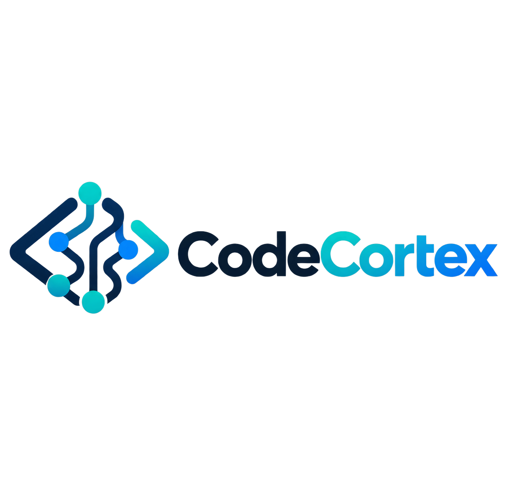

<p align="left"></p>

# CodeCortex

CodeCortex is a **local-first developer-intelligence layer for coding agents**. It combines deterministic repository understanding, project-scoped memory integration, observed run telemetry, impact/test/proof checks, and a live developer dashboard behind one MCP connection.

**Know the code. Remember the journey. Control the work. Prove the result.**

## Understand CodeCortex in the UI

The Developer Console includes a **How it works** page that explains the local-first MCP architecture, evidence sources, North-Star outcomes, and graph node meanings for non-technical and technical users.

## Install and connect

The recommended deployment is **one developer + one local CodeCortex installation + local stdio MCP**. CodeCortex can serve multiple local coding clients while keeping the repository graph authoritative to the actual workspace.

CodeCortex uses a simple setup similar to modern developer CLIs:

```bash
# install the CodeCortex binary/package
# then register it with the coding CLIs already on your machine
codecortex install
```

`codecortex install` auto-detects Codex, Claude Code and Gemini CLI and registers one local CodeCortex MCP. Enhanced host observation is enabled only where the host and local runtime support it. It does **not** install an intent classifier, planner, router, or second agent runtime. Use `codecortex install --host codex`, `--host claude`, or `--host gemini` to target one host.

For another MCP-compatible CLI or desktop app, run `codecortex install --generic` to print the standard local stdio configuration and optional loopback Streamable HTTP recipe.

CodeCortex never invents unavailable telemetry: token/cost data is shown only when the host or provider actually reports it. The core MCP and the enhanced Codex/Claude observation path use the same native CodeCortex binary; Python is not required at runtime. Hosts that do not expose deeper telemetry simply remain at MCP-only observation. See [`docs/HOST_OBSERVABILITY.md`](docs/HOST_OBSERVABILITY.md) and [`HEALTH_REPORT.md`](HEALTH_REPORT.md).

## Deployment modes

- **Local stdio MCP — recommended:** `codecortex <repo> --mcp --mcp-ui`
- **Local Streamable HTTP MCP — supported:** `codecortex <repo> --mcp --listen=127.0.0.1:7332 --mcp-ui`
- **Remote/non-loopback HTTP — advanced:** requires explicit bearer token, one pinned workspace, and external TLS/auth architecture. It is not the default GitHub quickstart.

See [`docs/DEPLOYMENT_ARCHITECTURE.md`](docs/DEPLOYMENT_ARCHITECTURE.md), [`docs/SERVICE_WIRING.md`](docs/SERVICE_WIRING.md), and [`docs/UI_WIRING.md`](docs/UI_WIRING.md).

## What the user sees

Install CodeCortex once, connect it to Codex (or another compatible MCP host), then work normally. The coding agent chooses CodeCortex tools when useful; the dashboard starts with the MCP and is available at `http://127.0.0.1:7331`.

```text
Coding agent
    |
    v
CodeCortex MCP
    |-- repository intelligence
    |-- project-scoped memory adapter
    |-- run telemetry and efficiency signals
    |-- code/work/memory graph
    |-- impact, test-selection and proof checks
    `-- local dashboard
```

Ask the host **"Show CodeCortex status"** to confirm the active repository, run identity, memory availability and dashboard endpoint.

## Install

Normal users should use a prebuilt CodeCortex release/package. Source builds are for developers only.

For a source build:

```bash
cmake -S . -B build -DCMAKE_BUILD_TYPE=Release
cmake --build build -j
sudo cmake --install build
```

Then run the unified setup:

```bash
codecortex install
```

It auto-detects supported coding hosts, registers the local CodeCortex MCP, and enables deeper observation only where the host/runtime supports it.

## Dashboard

The dashboard separates observed runtime evidence from structural repository evidence. Missing host telemetry is shown explicitly as **Not reported by host** rather than as a fabricated zero or estimate.

Primary graph modes:

- Live Run
- Code
- Architecture
- Dependencies
- Memory

## Repository layout

- `src/` — C++23 runtime and MCP server
- `ui/` — local developer dashboard
- `skills/` — CodeCortex agent skills
- `hooks/` — optional local host hooks
- `scripts/` — setup and engineering utilities
- `test/` — regression and integration checks
- `third_party/` — vendored dependencies and their licenses
- `LEGAL/`, `LICENSES/`, `NOTICE`, `THIRD_PARTY.md` — required licensing/provenance material

## License

CodeCortex-original work is licensed under the MIT License. This repository also contains inherited and third-party source under their original licenses; required notices are preserved in `LEGAL/`, `LICENSES/`, `NOTICE`, `THIRD_PARTY.md`, and applicable inherited source headers. See `LICENSING.md`.
